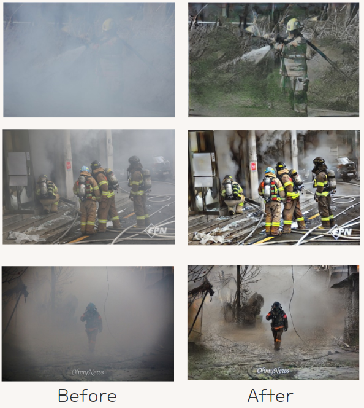
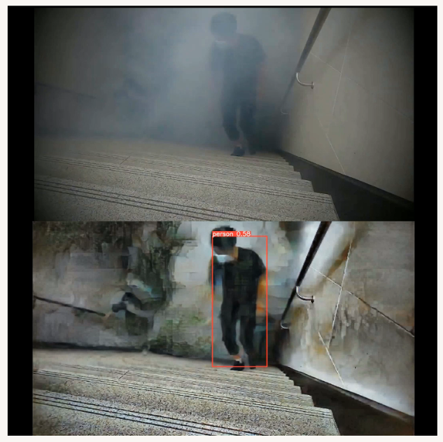
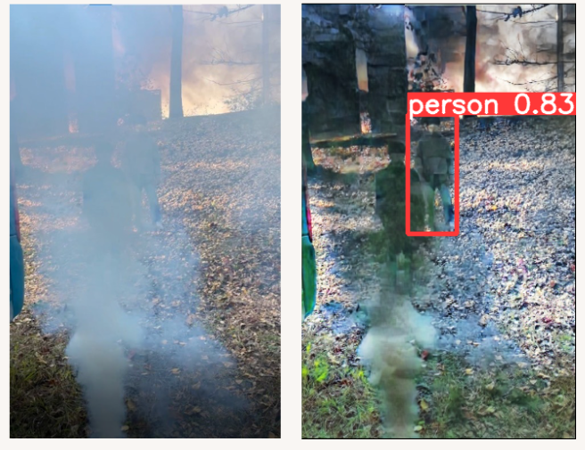

# EagleEyeDataServer

### 프로젝트 설명

화재 현장의 연기 제거 영상처리 및 객체 인식 기술을 통해 구조 대상자를 탐지하는 소방 구조 애플리케이션입니다.

### 프로젝트 결과

### 기술 스택
- **Language** - Java 17, Python3.6.8
- **Framework** - Spring Framework (Spring Boot), FastAPI, Tensorflow
- **Data(RDBMS)** - JPA/Hibernat, MySQL
- **Build Tool** - Gradle
- **Infra** - AWS EC2, AWS RDS, AWS S3
- **DB** - MySQL(RDS)

영상처리 및 객체탐지 서버 : https://github.com/Torres-09/EagleEyeVisionServer